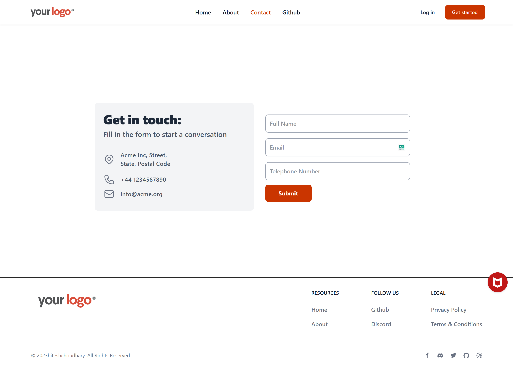

# Learn React Router Project

This project is a hands-on practice for understanding and implementing routing in React applications using the React Router library. It includes basic navigation, route parameters, and nested routes.

## 🚀 Live Preview 👉 [View Live](https://learn-react-router-pied.vercel.app/)

## Project Structure

The project is set up using Vite and includes the following main components:

*   `src/App.jsx`: Main application component where routes are defined.
*   `src/main.jsx`: Entry point of the React application.
*   `src/components/`: Directory containing reusable UI components.
    *   `Header.jsx`: Navigation header.
    *   `Footer.jsx`: Application footer.
    *   `Home.jsx`: Home page component.
    *   `AboutUs.jsx`: About Us page component.
    *   `ContactUs.jsx`: Contact Us page component.
    *   `Github.jsx`: Component to display GitHub user information (likely using route parameters and a loader).

## What I Learned from this Project

This section is for you to fill in with your specific learnings! Here are some common concepts you might have encountered while working with React Router:

*   **Setting up React Router:**
    *   Installing `react-router-dom`.
    *   Wrapping the main application with [`<BrowserRouter>`](https://reactrouter.com/en/main/router-components/browser-router).
*   **Defining Routes:**
    *   Using the [`<Routes>`](https://reactrouter.com/en/main/components/routes) and [`<Route>`](https://reactrouter.com/en/main/components/route) components to map paths to React components.
    *   Creating a layout route for shared UI elements like headers and footers using [`<Outlet />`](https://reactrouter.com/en/main/components/outlet).
*   **Navigation:**
    *   Using the [`<Link>`](https://reactrouter.com/en/main/components/link) component for declarative navigation.
    *   Using the [`useNavigate()`](https://reactrouter.com/en/main/hooks/use-navigate) hook for programmatic navigation.
*   **Route Parameters:**
    *   Defining dynamic segments in route paths (e.g., `/user/:userid`).
    *   Accessing route parameters using the [`useParams()`](https://reactrouter.com/en/main/hooks/use-params) hook.
*   **Active Link Styling:**
    *   Using [`<NavLink>`](https://reactrouter.com/en/main/components/nav-link) to style active navigation links.

*(Please replace or add to the list above with your actual experiences and insights gained from building this project.)*

## Available Scripts

In the project directory, you can run:

### `npm run dev` or `yarn dev`

The page will reload if you make edits.\
You will also see any lint errors in the console.

### `npm run build` or `yarn build`

Builds the app for production to the `dist` folder.\
It correctly bundles React in production mode and optimizes the build for the best performance.

Your app is ready to be deployed!

# Screenshot

